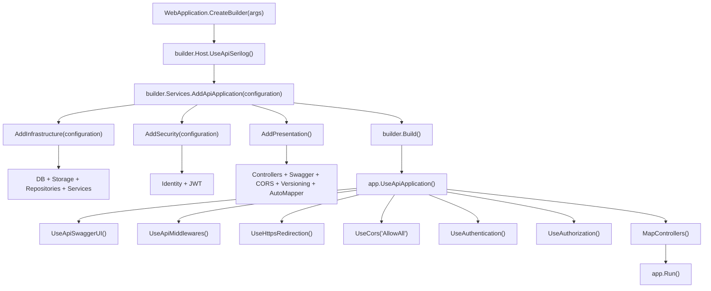

# Guia de Extensions

Esta carpeta centraliza las extensiones de configuracion de arranque usadas por `Program.cs`.

## Proposito de cada carpeta

- `ServiceCollection/`
  - Se usa para el registro de dependencias (`builder.Services...`).
  - Ejemplos: base de datos, auth, bindings de DI, controllers, swagger, CORS, versionado.
  - Los metodos de esta carpeta normalmente retornan `IServiceCollection`.

- `ApplicationBuilder/`
  - Se usa para configurar el pipeline HTTP (`app...`).
  - Ejemplos: cadena de middlewares, swagger UI, orden de auth/authorization, mapeo de endpoints.
  - Los metodos de esta carpeta normalmente retornan `WebApplication`.

- `HostBuilder/`
  - Se usa para configuracion a nivel host (`builder.Host...`).
  - Ejemplos: proveedores de logging e integraciones globales del host (como Serilog).
  - Los metodos de esta carpeta normalmente retornan `IHostBuilder`.

## Composicion actual

- `AddApiApplication(...)` orquesta el registro de servicios por capa:
  - `AddInfrastructure(...)`
  - `AddSecurity(...)`
  - `AddPresentation()`

- `UseApiApplication()` orquesta la configuracion del pipeline de requests:
  - Swagger UI
  - Middlewares personalizados
  - HTTPS
  - CORS
  - Authentication/Authorization
  - Mapeo de controllers

## Convenciones

- Mantener cada clase de extension enfocada en una sola responsabilidad.
- Preferir metodos orquestadores (`AddApiApplication`, `UseApiApplication`) en `Program.cs`.
- Mantener `Program.cs` como entrypoint, no como un archivo cargado de configuracion.
- Usar el namespace `ApiMovies.Common.Extensions` en todos los archivos de extensiones.

## Uso rapido

```csharp
var builder = WebApplication.CreateBuilder(args);
builder.Host.UseApiSerilog();
builder.Services.AddApiApplication(builder.Configuration);

var app = builder.Build();
app.UseApiApplication();
app.Run();
```

## Diagrama de flujo (builder -> services -> app -> pipeline)


